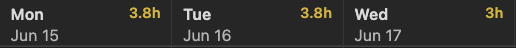
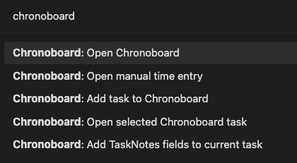

# Chronoboard Changelog

## 0.7.0

### Added

- Managed vault notes for:
  - `Getting Started With Chronoboard`
  - `Chronoboard - Changelog`
- Command palette actions for opening the guide and changelog
- Toolbar help button for opening the Chronoboard guide
- Time entry note template support
- Better onboarding guidance around status frontmatter and task setup

### Improved

- Time entry notes can be renamed safely and reopened through Chronoboard entry IDs and aliases
- Totals sorting control now supports multiple sort modes through a compact icon trigger
- Documentation and onboarding flow for first install and plugin updates
- Header totals presentation in Chronoboard summary and week views

### Fixed

- Time entry note creation no longer duplicates conflicting frontmatter keys from templates
- Deleted time entry notes now correctly show `Create time entry note` instead of `Open time entry note`
- Template note resolution now supports normal Obsidian-style paths with or without `.md`

### Clarified Interactions

- Double click a time block to remove it
- Hold and drag a time block to move it
- Use `Ctrl+Z` or `Cmd+Z` to undo block creation or removal
- Removing a task from the left rail does not remove existing tracked time from the board

### Release visuals

## 0.6.2

### Added

- Managed vault notes for:
  - `Getting Started With Chronoboard`
  - `Chronoboard - Changelog`
- Command palette actions for opening the guide and changelog
- Toolbar help button for opening the Chronoboard guide
- Time entry note template support

### Improved

- Time entry notes can be renamed safely and reopened through Chronoboard entry IDs and aliases
- Totals sorting control now supports multiple sort modes through a compact icon trigger
- Documentation and onboarding flow for first install and plugin updates

### Fixed

- Time entry note creation no longer duplicates conflicting frontmatter keys from templates
- Deleted time entry notes now correctly show `Create time entry note` instead of `Open time entry note`
- Template note resolution now supports normal Obsidian-style paths with or without `.md`

### Clarified Interactions

- Double click a time block to remove it
- Hold and drag a time block to move it
- Use `Ctrl+Z` or `Cmd+Z` to undo block creation or removal
- Removing a task from the left rail does not remove existing tracked time from the board
