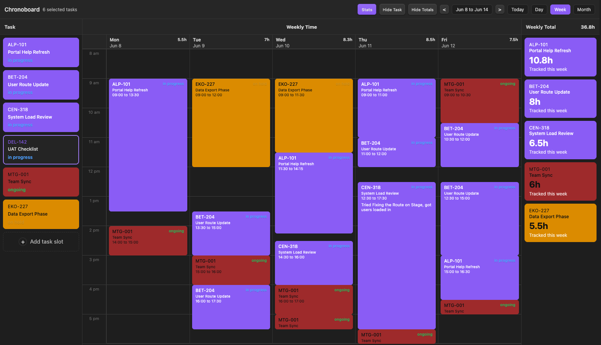
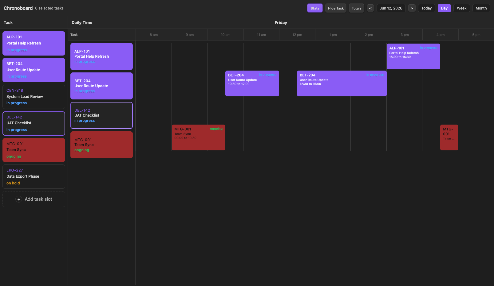
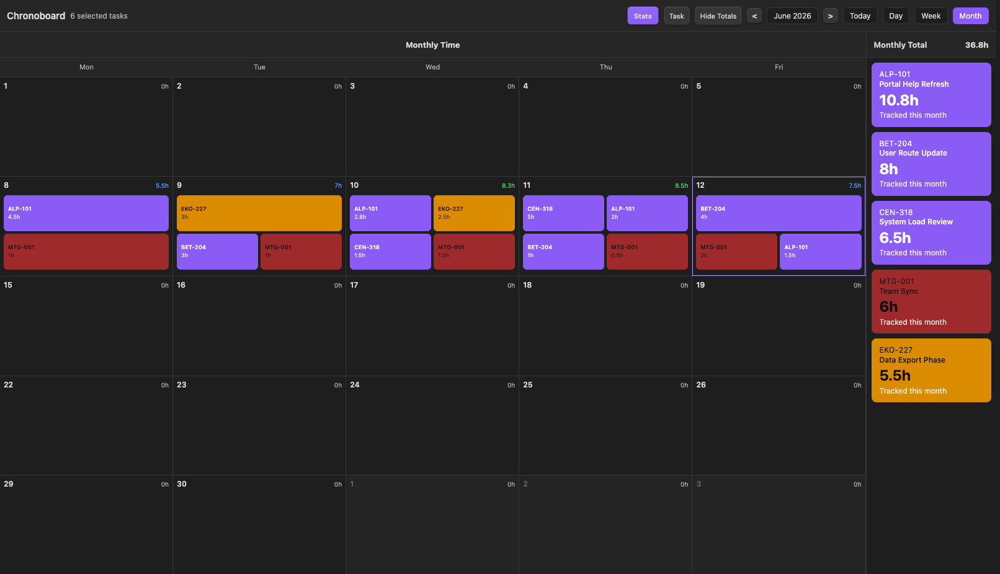

# Chronoboard

Chronoboard is an Obsidian community plugin for visual, task-native time tracking.

It turns Markdown tasks into draggable time blocks across day, week, and month views while writing time data back into frontmatter. Chronoboard works well with TaskNotes-style task notes, but it is not tied to Jira, TaskNotes, or any specific vault structure.

## What Chronoboard Does

- Builds a left-side task pool from a folder in your vault
- Lets you click and drag time blocks onto a day or week board
- Stores time entries directly in task frontmatter
- Supports dedicated time entry notes for individual blocks
- Tracks scoped totals for day, week, and month
- Keeps the data portable because the source of truth remains Markdown

## Core Workflow

1. Configure a task folder and a metadata property such as `Status`.
2. Make sure the task files you want to use actually contain that frontmatter property so they can appear in the Chronoboard task pool.
3. Add tasks into the Chronoboard side rail.
4. Select a task and drag on the board to create time.
5. Move or resize blocks directly on the board.
6. Use right-click actions for color, subtitles, block notes, precise edits, and time entry notes.

## Views

- `Day`: horizontal time planning for a single day
- `Week`: vertical multi-day planning with per-day totals
- `Month`: high-level overview of tracked time across the month
- `Stats`: summary-oriented view for totals and reporting

## Interaction Model

### Time blocks

- Click and drag to create a time block
- Hold and drag to move a time block
- Drag the handles to resize a time block
- Double click a time block to remove it
- Use `Ctrl+Z` or `Cmd+Z` to undo time block add or remove actions

### Right click on a time block

- `Open task note`
- `Change color`
- `Edit task subtitle`
- `Edit task block text`
- `Create time entry note` or `Open time entry note`
- `Precise Edit Time`
- `Remove time block`

### Right click on a task in the side panels

- `Open task note`
- `Change color`
- `Edit task subtitle`
- `Remove Task`

Removing a task from the left task rail does not remove existing time blocks from the board. It only removes that task from the currently selected pool.

## Commands

Chronoboard adds the following commands to the Obsidian command palette:

- `Open Chronoboard`
- `Add task to Chronoboard`
- `Open manual time entry`
- `Open selected Chronoboard task`
- `Open Chronoboard guide`
- `Open Chronoboard changelog`
- `Add TaskNotes fields to current task`

## Managed Vault Notes

Chronoboard can create and maintain helper notes inside your vault:

- `Getting Started With Chronoboard`
- `Chronoboard - Changelog`

On first install, the guide note opens automatically. On plugin updates, the changelog note opens automatically.

## Frontmatter

Chronoboard reads and writes these properties when present:

```yaml
title: "Example Task"
Status: "In Progress"
timeboardColor: "#7c5cff"
timeboardSubtitle: "Project subtitle"
timeEntries:
  - startTime: "2026-06-12T09:00:00"
    endTime: "2026-06-12T11:00:00"
    label: "Worked on API review"
```

If you enable dedicated time entry notes, Chronoboard can also write:

```yaml
aliases:
  - chrono-1234567890-abcd12
Links: "[[Example Task]]"
ChronoboardEntryId: chrono-1234567890-abcd12
ChronoboardParent: "[[Example Task]]"
ChronoboardStart: 2026-06-12T09:00
ChronoboardEnd: 2026-06-12T11:00
```

## Settings

- `Folder`
- `Time entry notes folder`
- `Time entry note template`
- `Always include tasks`
- `Metadata property`
- `Excluded values`
- `Hide weekends in week and month views`
- `Visible start hour`
- `Visible end hour`
- `Highlight color`
- `Force dark text on colored cards`

## Screenshots

### Week view



### Day view



### Month view



## Release Files

GitHub releases should include:

- `manifest.json`
- `main.js`
- `styles.css`
- `versions.json`

## Changelog

See [CHANGELOG.md](CHANGELOG.md) for release notes.
